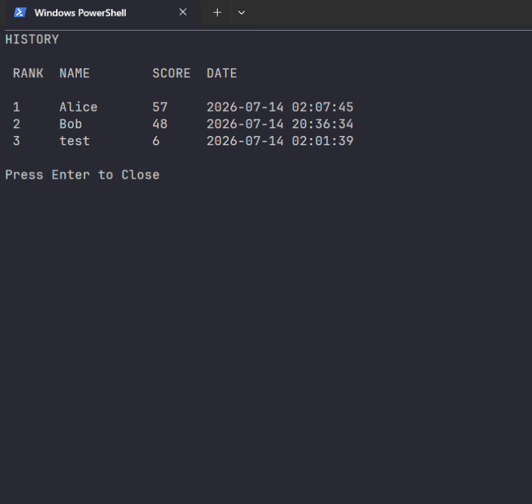

# Snake Game

A console-based Snake game written in C++ for the Windows console.

Customize the game field, speed, and food count, challenge yourself to achieve the highest score, and save your records locally.

---

## Screenshots





---

## Features

- Console-based Snake Game
- Title Screen
- Settings Menu
- High Score System
- Local Score Saving
- Adjustable Field Size
- Adjustable Game Speed
- Adjustable Food Count
- Reset Settings
- Random Food Generation
- Screen Wrap Movement
- Score Counter
- Game Over Screen
- Game Clear
- Restart Function

---

## Gameplay

- Move the snake using **W**, **A**, **S**, and **D**.
- Eat food to increase your score and grow longer.
- The snake wraps around the edges of the field.
- Avoid colliding with your own body.
- Fill the entire field to clear the game.
- Save your score after each game.

---

## Controls

### In Game

| Key | Action |
| :-- | :----- |
| `W` | Move Up |
| `A` | Move Left |
| `S` | Move Down |
| `D` | Move Right |

### In Menus

| Key | Action |
| :-- | :----- |
| `Tab` | Move Cursor |
| `←` `→` | Change Setting Value |
| `Enter` | Confirm |

---

## Settings

| Item | Range | Default |
| :--- | :---: | :---: |
| Width | 20–60 | 40 |
| Height | 10–30 | 20 |
| Speed | 1–3 | 2 |
| Food Spawn | 1–5 | 1 |

---

## High Scores

Game records are stored automatically in

```
history/history.txt
```

Each record contains:

- Player Name
- Score
- Date and Time

The game displays the top 30 scores sorted by highest score.

---

## Requirements

- Windows
- C++17 or later
- g++

---

## Build

```bash
g++ main.cpp -std=c++17 -O2 -o snake.exe
```

---

## Run

```bash
.\snake.exe
```

---

## Project Structure

```
Snake-Game/
├── README.md
├── main.cpp
├── history/
│   └── history.txt      (Automatically Generated)
└── images/
    ├── title.png
    ├── settings.png
    ├── history.png
    └── gameplay.png
```

---

## License

This project is released under the MIT License.
