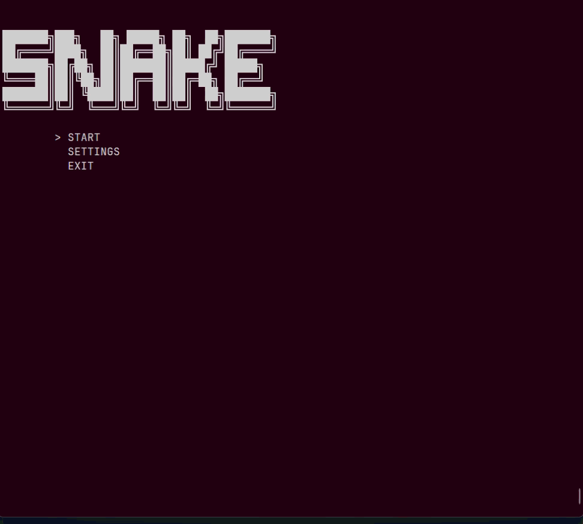
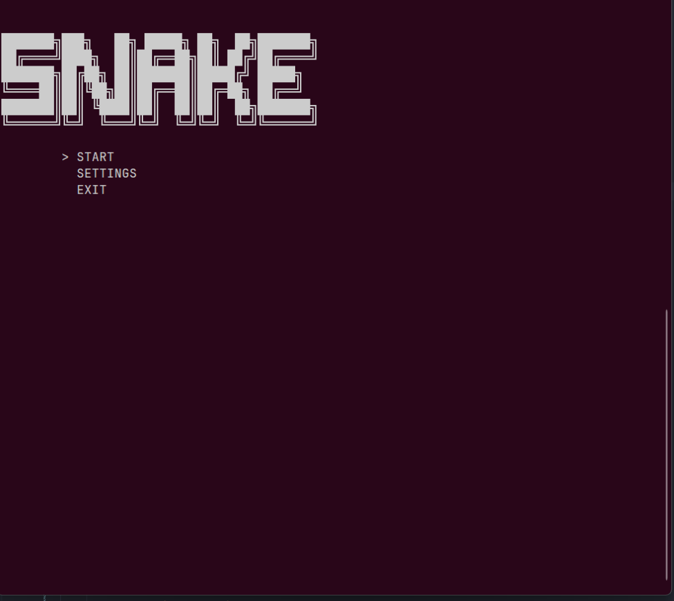
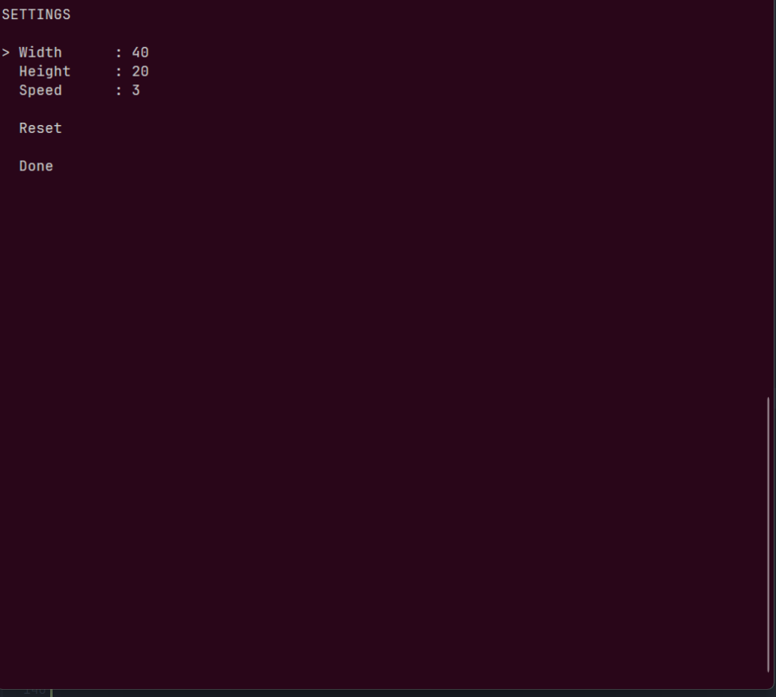
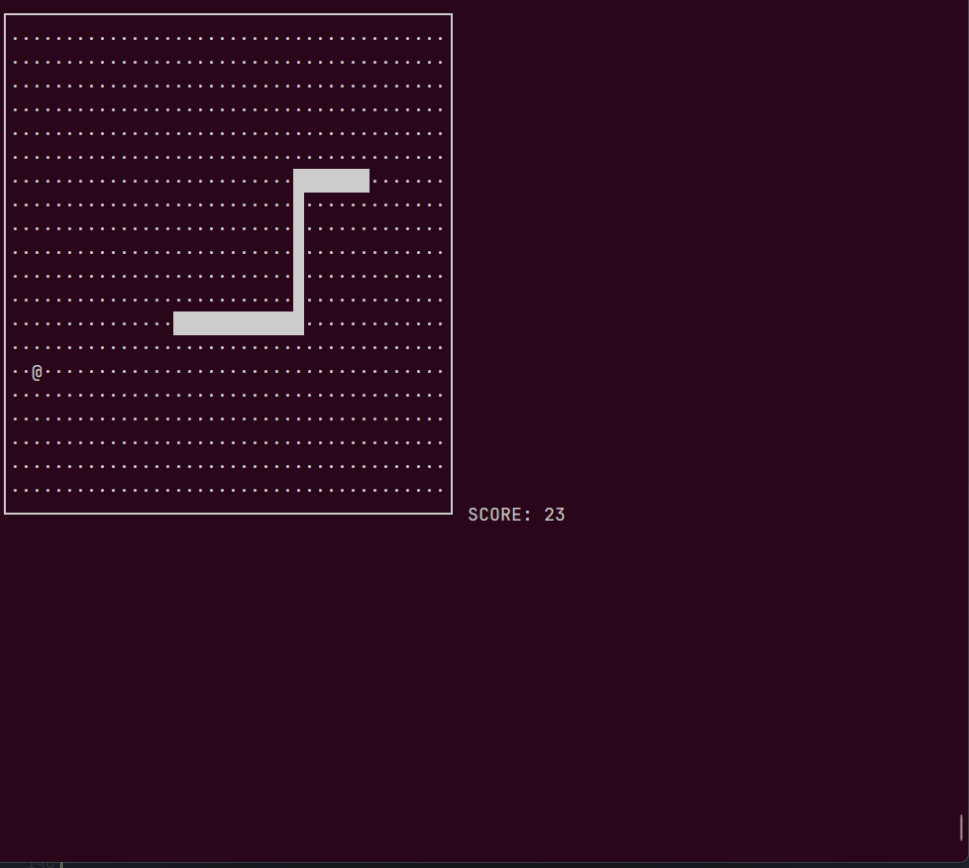

# Snake Game

A console-based Snake game written in C++ for the Windows console.

This project features a title screen, configurable game settings, score tracking, and restart functionality.

---

## Demo





---

## Screenshots









---

## Features

- Console-based Snake Game
- Title Screen
- Settings Menu
- Adjustable Field Size
- Adjustable Game Speed
- Reset Settings
- Random Food Generation
- Score Counter
- Game Over Screen
- Game Clear
- Restart Function

---

## Gameplay

- Control the snake using **W**, **A**, **S**, and **D**.
- Eat food to increase your score and grow longer.
- Avoid colliding with your own body.
- Fill the entire field to clear the game.

---

## Controls

### In Game

| Key | Action |
| :-- | :----- |
| `W` | Move Up |
| `A` | Move Left |
| `S` | Move Down |
| `D` | Move Right |

### In Menus

| Key | Action |
| :-- | :----- |
| `Tab` | Move Cursor |
| `←` `→` | Change Setting Value |
| `Enter` | Confirm |

---

## Settings

| Item | Range | Default |
| :--- | :---: | :---: |
| Width | 20–60 | 40 |
| Height | 10–30 | 20 |
| Speed | 1–5 | 3 |

---

## Requirements

- Windows
- C++17
- g++

---

## Build

```bash
g++ main.cpp -std=c++17 -O2 -o snake.exe
```

---

## Run

```bash
.\snake.exe
```

---

## Project Structure

```
Snake/
├── README.md
├── main.cpp
├── images/
│   ├── demo.gif
│   ├── title.png
│   ├── settings.png
│   └── gameplay.png
└── .gitignore
```

---

## Future Improvements

- Difficulty Presets
- High Score Saving
- Pause Function
- Color Themes
- Sound Effects

---

## License

This project is released under the MIT License.
